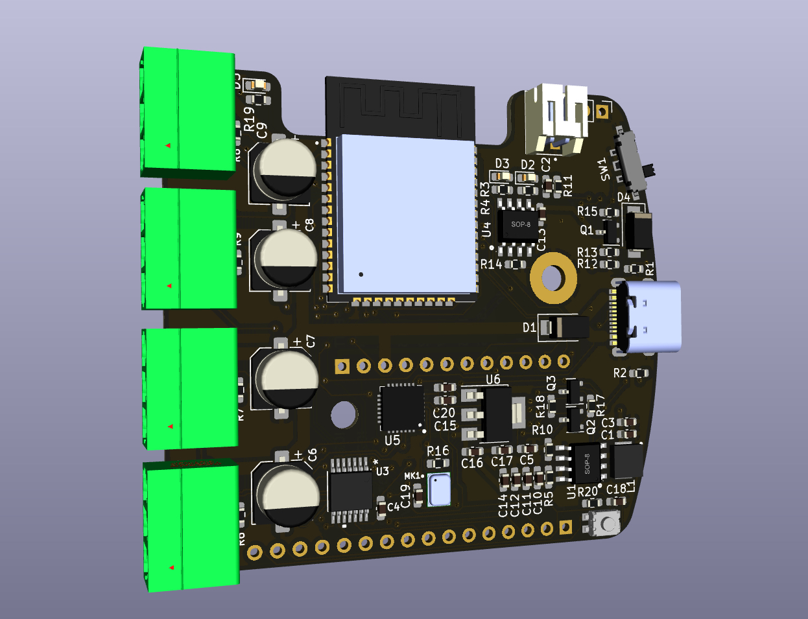
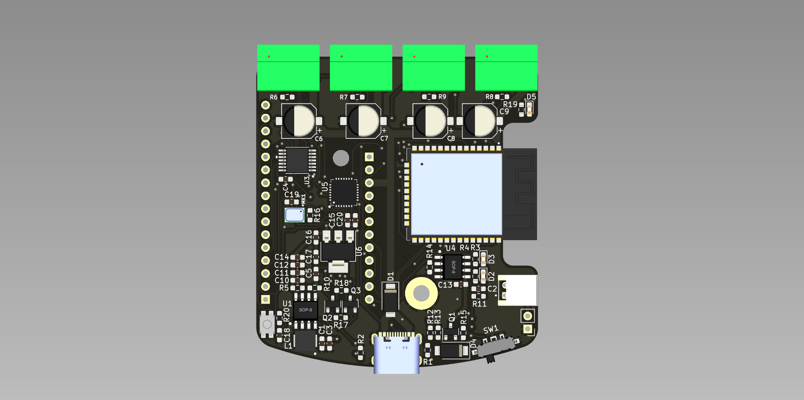
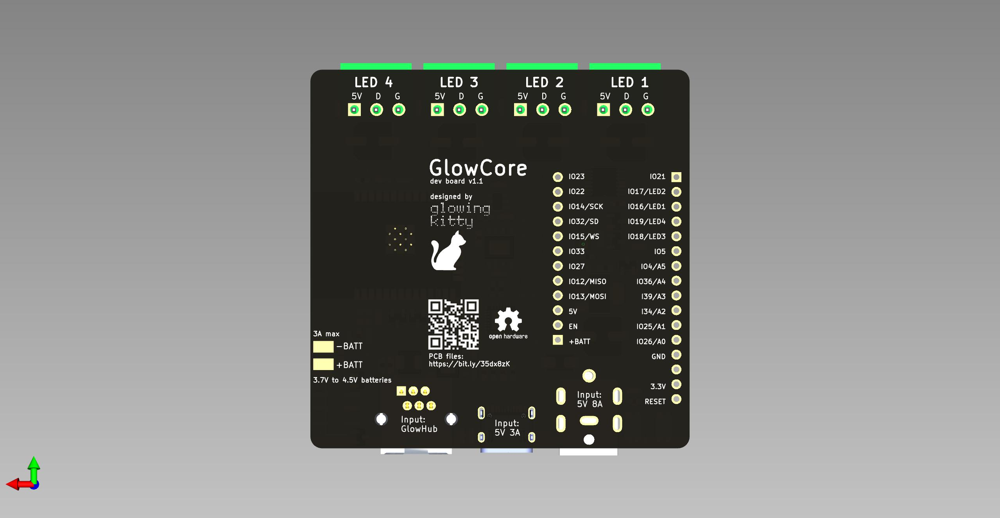

# GlowCore

## Warning:

This project is currently under active development and has not been fully tested yet. If you decide to build or clone the project, be aware the project might not work yet as expected. Use at your own risk.

## What is this project?

A custom PCB design for controlling my LED projects. Connect up to 4 LED strips, program the integrated ESP32, and power everything via USB-C or a lipo battery.

